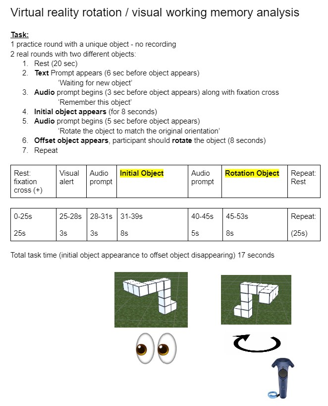

<h1 align="center" > Data analysis for James' M.S. project </h1>

<h2 align="center" > What is this? </h2>

 Data analysis for both fNIRS and EEG recorded from a virtual reality visuo-spatial memory paradigm. 
 

<h2 align="center" > Experiment description </h2>
Participants were asked to comlete a VR task which involves visuo-spatial memory. They are asked to remember the orientation of an object ('Stimulus object') which appears briefly in front of them. Then, a rotated version of the same object appears ('Rotation object') and they are tasked with rotating the object to match the original orientation usign the VR controller. See the description below.

<h2 align="center" > Usage </h2>

 The data and figures are all saved in the Data folder under each participants name and session date. Only two participants are included here, each with one recording session. 
 

 Analysis.py is where the data is loaded, preprocessed, and visualized. The figures are already created and saved for each participant 
 
